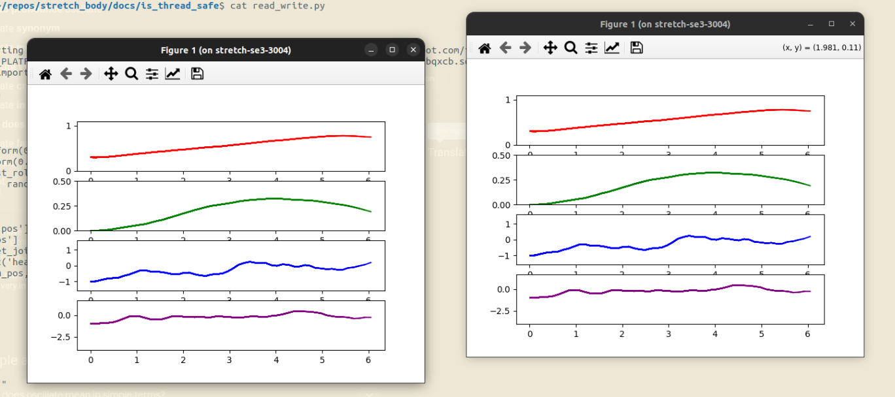

# Is Stretch Body thread safe?

The short answer: yes, if you don't use asyncio. This tutorial builds up to a few kinds of threading experiments that prove this, and hopefully will serve as a launching point for further exploration.

First, let's define what it means to be thread-safe. If we create an instance of the `Robot` class, we'd like to know if we can safely use it in Python threads. Using the `Robot`, there's two ways we interact with the underlying hardware: reading sensor data and writing motion commands. Our experiments will cover:

 1. Single threaded reading and writing
 2. Single writer, but multithreaded readers
 3. Multithreading for both reading and writing

Having multiple readers, even if only one thread can send commands, would be useful for visualization purposes.

## Writing

Let's create an instance of the `Robot`:

```python
import stretch_body.robot

r = stretch_body.robot.Robot()
assert r.startup()
assert r.is_homed()
```

Then create a "writer", that will send motion commands:

```python
import random

def write():
    r.lift.move_to(random.uniform(0.3, 1.1))
    r.arm.move_to(random.uniform(0.0, 0.4))
    r.end_of_arm.move_to('wrist_roll', random.uniform(-1.0, 1.0))
    r.head.move_to('head_pan', random.uniform(-1.0, 1.0))
    r.push_command()
```

Then let's define a writing-only runner, that sends motion commands at 10hz:

```python
def wo_runner():
    """write-only runner"""
    while True:
        write()
        time.sleep(0.1)
```

### Results

We can run `wo_runner()` in the main thread:

```python
wo_runner()
```

or launch it in a thread:

```python
import threading
threading.Thread(target=wo_runner).start()
```

When AsyncIO is turned on, the program exits with no error. Likely an exception is being thrown in the thread, but isn't being surfaced to the user. Surfacing this exception is the first step towards making this library thread-safe with AsyncIO.

However, if we [disable AsyncIO](https://github.com/hello-robot/stretch_body/blob/master/docs/robot_parameters.md#use_asyncio), we'll see the robot start to jitter and it tracks random motion goals.

Next, we can run multiple threads with no problem:

```python
import threading

threading.Thread(target=wo_runner).start()
threading.Thread(target=wo_runner).start()
```

### High-Low Competition

In the previous experiment, it's hard to tell the two-thread jitter apart from the one-thread jitter. So let's write two competing writers:

```python
def low_write():
    r.lift.move_to(0.3)
    r.arm.move_to(0.0)
    r.end_of_arm.move_to('wrist_roll', -1.0)
    r.head.move_to('head_pan', -1.0)
    r.push_command()

def high_write():
    r.lift.move_to(1.1)
    r.arm.move_to(0.4)
    r.end_of_arm.move_to('wrist_roll', 1.0)
    r.head.move_to('head_pan', 1.0)
    r.push_command()
```

and create runners for each:

```python
def low_rw_runner():
    """read-and-write runner"""
    pl=NBPlot()
    while True:
        low_write()
        read(pl)
        time.sleep(0.1)

def high_rw_runner():
    """read-and-write runner"""
    pl=NBPlot()
    s = time.time()
    while time.time() - s < 10:
        high_write()
        read(pl)
        time.sleep(0.1)
```

Then, launch them with:

```python
if __name__ == "__main__":
    import threading
    threading.Thread(target=low_rw_runner).start()
    threading.Thread(target=high_rw_runner).start()
```

Running this, we'll see the threads compete with one another, and the joints will oscillate between their limits, depending on which thread is given more processing time by the operating system at that moment. After 10 seconds, the high writer dies, and the robot moves to its lower joint limits.

## Reading

Let's create a "reader", that will plot the joint states for the four joints:

```python
def read(plotter):
    lift_pos = r.lift.status['pos']
    arm_pos = r.arm.status['pos']
    roll_pos = r.end_of_arm.get_joint('wrist_roll').status['pos']
    pan_pos = r.head.get_joint('head_pan').status['pos']
    plotter.plot(lift_pos, arm_pos, roll_pos, pan_pos)
```

Then let's define a reading-only runner, that will plot joint state at 10hz:

```python
def ro_runner():
    """read-only runner"""
    pl=NBPlot()
    while True:
        read(pl)
        time.sleep(0.1)
```

`NBPlot` is defined within `multiprocessing_plotter.py` in this folder. It enables Matplotlib to plot within threads.

### Results

We can run `ro_runner()` in the main thread without any issues, but if we launch `ro_runner()` in a thread:

```python
import threading
threading.Thread(target=ro_runner).start()
```

Once again, the program exits with no error if we use asyncio and works fine if we disable it. Surfacing the underlying error will be helpful to debug.

## Reading and Writing

For completion, we have `wr_runner()`:

```python
def rw_runner():
    """read-and-write runner"""
    pl=NBPlot()
    while True:
        write()
        read(pl)
        time.sleep(0.1)
```

We run it with:

```python
import threading

threading.Thread(target=rw_runner).start()
threading.Thread(target=rw_runner).start()
```

And we'll see two live plots pop up and show the robot tracking the motion commands being sent by the two threads.



## Code

The code for this experiment lives in two files within this same directory:

 - `read_write.py`: which defines the reading and writing runners
 - `low_high_competition.py`: which defines the low & high writers that compete in two threads
 - `multiprocessing_plotter.py`: which is a helper library for plotting within Python threads. The logic does not impact these experiments.

## Takeaway

This document captures a few experiments around Stretch Body's thread safety. It shows that the library is currently thread safe only if you disable AsyncIO, and highlights some possible ways to start debugging how to make the library thread-safe with AsyncIO.
